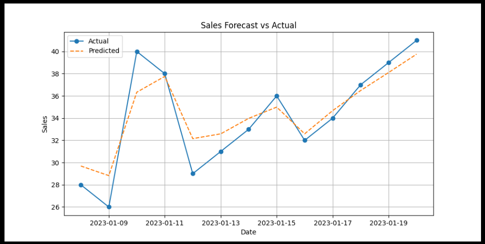
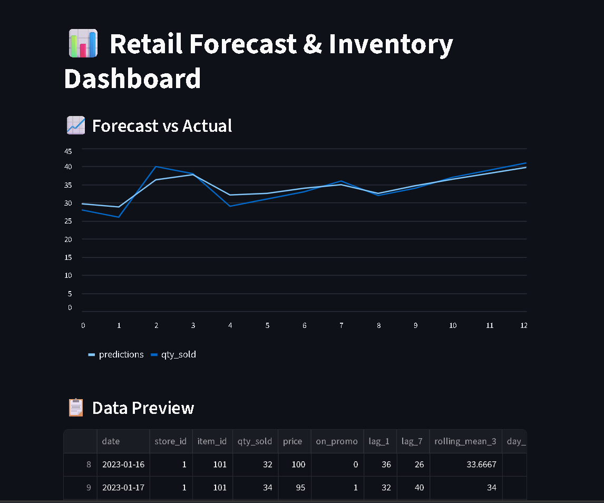
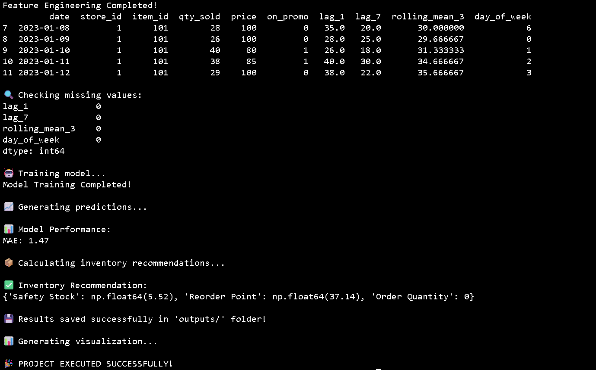
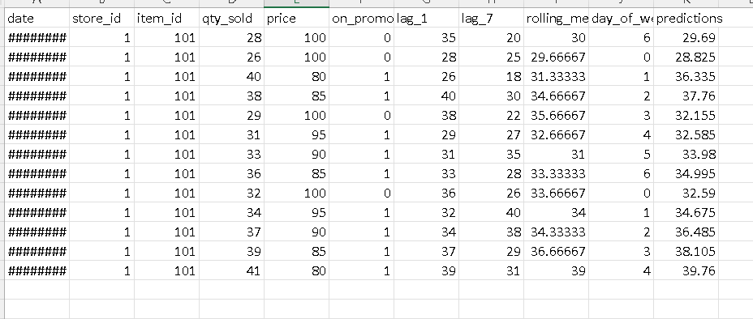

# 📊 Retail Sales Forecasting & Inventory Optimization System

🚀 **End-to-End Data Science Project | Forecasting + Inventory Optimization + Dashboard**

---

## 🧠 Project Overview

Retail businesses often struggle with maintaining the right inventory levels.

* 📉 Overstock → High holding cost
* 📉 Stockouts → Lost sales

This project solves this problem by combining **Machine Learning + Business Logic** to:

✔ Forecast future sales
✔ Optimize inventory decisions
✔ Provide actionable insights via dashboard

---

## 🎯 Problem Statement

Traditional inventory systems rely on manual estimation, leading to:

* Inaccurate demand planning
* Inefficient stock management
* Revenue loss

👉 This system automates demand forecasting and inventory optimization.

---

## 🛠️ Tech Stack

* **Programming:** Python 🐍
* **Libraries:** Pandas, NumPy, Scikit-learn
* **Visualization:** Matplotlib
* **Dashboard:** Streamlit
* **Version Control:** Git & GitHub

---

## ⚙️ Features

✔ Data preprocessing and cleaning
✔ Feature engineering (lag features, rolling mean, time features)
✔ Sales forecasting using Random Forest
✔ Inventory optimization:
    • Safety Stock
    • Reorder Point (ROP)
    • Order Quantity
✔ Model evaluation using MAE
✔ Visualization of actual vs predicted sales
✔ Interactive dashboard using Streamlit

---

## 📂 Project Structure

```
Retail-Sales-Forecasting/
│
├── data/                 # Dataset
├── src/                  # Core modules
├── app/                  # Streamlit app
├── outputs/              # Generated results
├── images/               # Screenshots
│
├── main.py               # Main pipeline
├── requirements.txt      # Dependencies
├── .gitignore
└── README.md
```

---

## ▶️ How to Run

### 🔹 Step 1: Clone Repository

```bash
git clone https://github.com/Vayu-143/retail-sales-forecasting-inventory-optimization
cd retail-sales-forecasting-inventory-optimization
```

---

### 🔹 Step 2: Create Virtual Environment

```bash
python -m venv .venv
.\.venv\Scripts\Activate   # Windows
```

---

### 🔹 Step 3: Install Dependencies

```bash
pip install -r requirements.txt
```

---

### 🔹 Step 4: Run Project

```bash
python main.py
```

---

### 🔹 Step 5: Run Dashboard

```bash
streamlit run app/app_streamlit.py
```

---

## 📊 Results

* 📉 Model Accuracy (MAE): **~1.47**
* 📈 Accurate sales forecasting trends
* 📦 Inventory recommendations generated

---

## 📸 Screenshots

### 📈 Sales Forecast vs Actual



---

### 📊 Streamlit Dashboard



---

### 💻 Terminal Output



---

### 📄 CSV Output



---

## 🌐 Live Demo

```
http://localhost:8501/
```

---

## 💼 Business Impact

✔ Improves demand planning
✔ Reduces stockouts and lost revenue
✔ Optimizes inventory holding cost
✔ Enables data-driven decision-making

---

## 🔥 Key Highlights

✔ End-to-end pipeline (data → model → business output)
✔ Real-world retail use case
✔ Combines ML + operations logic
✔ Interactive dashboard

---

## 🚀 Future Improvements

* Multi-store & multi-product forecasting
* Advanced models (XGBoost, Prophet)
* Real-time dashboard
* API deployment

---

## 👨‍💻 Author

Vayunandan Mishra
Aspiring Data Scientist | Machine Learning Enthusiast

---

## ⭐ If you like this project

Give it a ⭐ on GitHub and connect with me!
